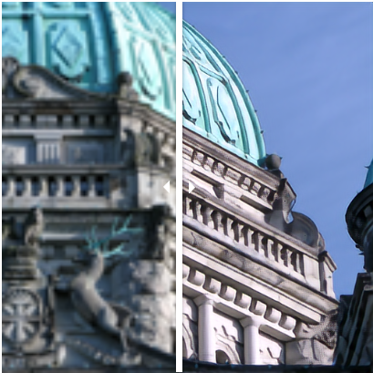
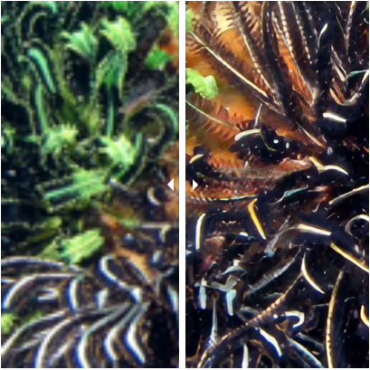

# Super Resolution GAN Training Repository

<div align="center">
<table>
  <tr>
    <td align="center">
      <br>
    </td>
    <td align="center">
      <br>
    </td>
    <td align="center">
      <br>
    </td>
    <td align="center">
      <br>
    </td>
  </tr> 
</table>
</div>

## 1. Dependencies and Installation

- Python == 3.12.3
- PyTorch == 2.4.1
- CUDA == 12.6
- Other required packages in `requirements.txt`

```
# git clone this repository
git clone https://github.com/brulonga/GAN.git
cd GAN

# create python environment
python3 -m venv venv_GAN
source venv_GAN/bin/activate

# install python dependencies
pip install -r requirements.txt
```
The code is implemented for single GPU training with mixed precision. High memory GPU may be needed.

## 2. GAN Training

As a basis, the RRDBNet and the Spectral Unet discriminator from Real-ESRGAN are provided. You can control every training detail from the ```config/esrgan.yml```:

```
wandb:
    use: True --> use flag
    project: ""
    entity : ""
    tags   : [""]

training:
    only_l2: False --> in case you want to train only l2 loss without Gan or perceptual loss (first training stage)
    batch_size:  
    epochs: 
    log_freq: --> frequency os validation (epochs)
    lpips_weight: --> weight of the perceptual loss (LPIPS) 
    gan_weight_max: --> max weight thta reaches the GAN Loss after the annealing
    annealing: True --> flag if you want to use Gan weight annealing
    start_epoch: --> start epoch for the annealing
    end_epoch: --> end epoch for the annealing (gan weight reaches the max value)
    sharp: False --> USMSharp use (sharp ground truth images)

optim:
    weight_decay: 0.01
    optimizer: "AdamW"
    lr: --> generator learning rate
    lr_discriminator: --> discriminator learning rate 
    beta1: 0.9
    amsgrad: True --> flag to use mixed precision
    eps: 0.00000001
    grad_clip: 1.0 --> clipping gradient for avoiding crashes

data:
    number_deg: 0/1 --> 0: bicubic | 1: real-esrgan degradations
    crop_size: --> crops for trainning
    scale: 4
    channels: 3
    debug: -1 # -1 No debugging, N number of debugging samples
    num_workers: 8
    ssl_datasets: [
                    "", --> DIV2K, FLICKR2K, LSDIR, PIPAL, RealSR
                    ]

generator:
    pick : 0 --> choose a generator from the list of generators
    models:
        -   arch: "esrgan" --> you can add more archs the same way
            model: "generator"
            in_ch: 3
            out_ch: 3
            num_feat: 64
            scale: 4
            num_intermediate_ch: 32
            num_blocks: 23
            ckpt: #"/model_zoo/RealESRGAN_x4plus.pth" --> in case you want to resume a training, pretrainned l2 weights are recomended

discriminator:
    pick : 0 --> choose a discriminator from the list of descriminators
    models:
        -   arch: "spectralunet"
            model: "discriminator"
            in_ch: 3
            num_feat: 64
            ckpt: #"/model_zoo/RealESRGAN_x4plus_netD.pth" --> in case you want to resume a training, pretrainned l2 weights are recomended
```

For training: ```python run_sr.py --device 0 (or the one you want to train in) --config /config/esrgan.yml --test /config/test.yml --name esrgan```

## 3. GAN Validation

Every ```log_freq``` epochs the validation of the GAN is conducted on 2 types of datsets which you can control from the ```config/test.yml```:

```
test:
    - DIV2K_LSDIR: --> Reference metrics validation dataset
        hr: "/.../DIV2K_LSDIR/GT/validation"
        lr: "/.../DIV2K_LSDIR/bicubic/validation"
        n: 200 --> number of expected samples
        scale: 4

    - RealSR: --> No Reference metrics validation dataset, more time consuming cause of the metrics being nets. Just NIQE is implemented right now. 
        lr: "/.../RealSR_validation" --> just lr images
        n: 20 --> number of images you want to evaluate 
```
